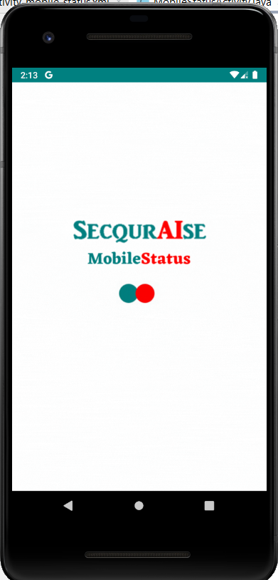
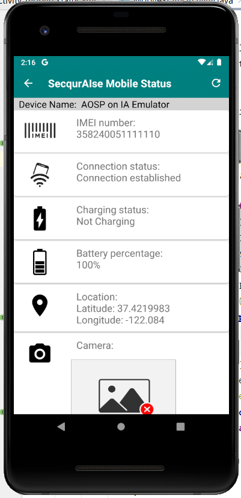
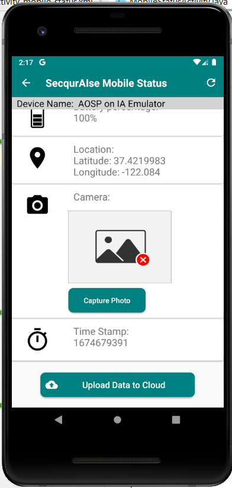
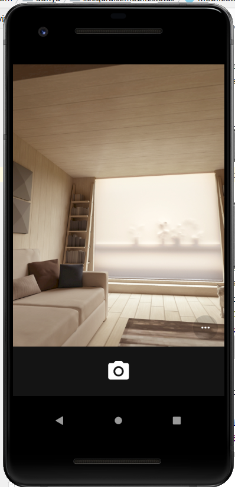
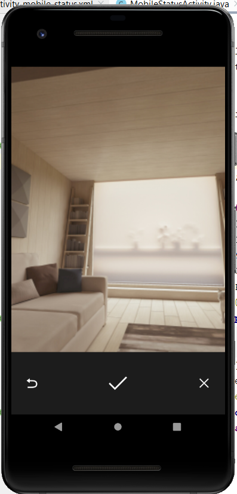
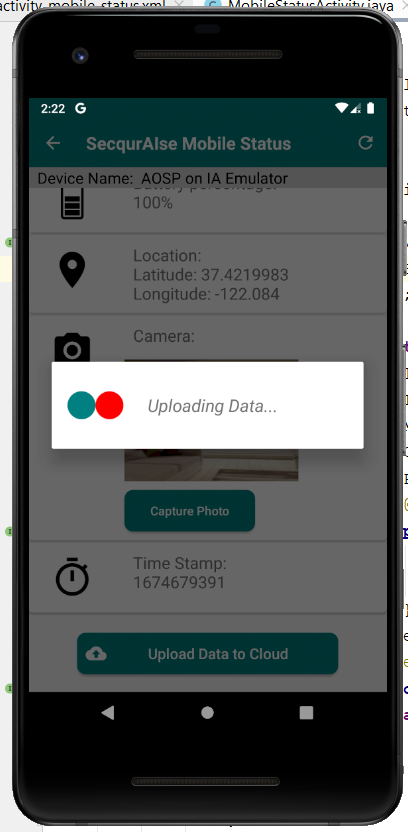
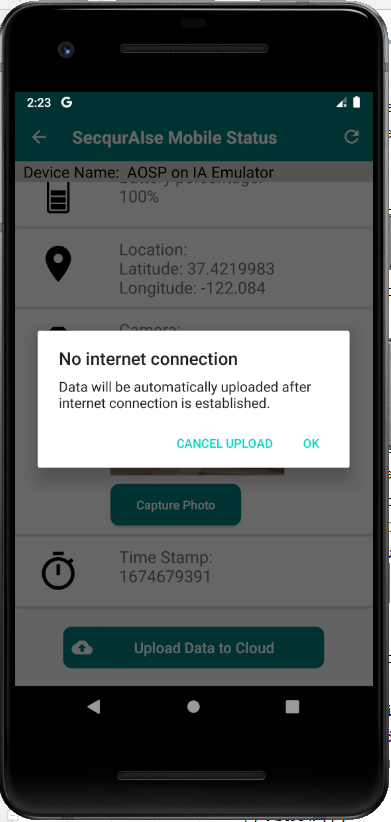

# SecquraiseMobileStatus

This project is a part of an assignment given by SecqurAIse.

# Screenshots 

       

### APK: https://drive.google.com/file/d/1DFq6FvNcMiXKRj42S4AmNWPRAO3Og-5a/view?usp=sharing
